<p align="center">
  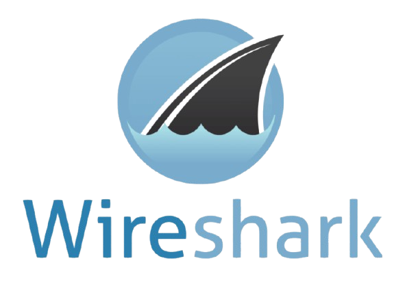
</p>

<h1 align="center">🔬 Wireshark Network Traffic Analysis Lab</h1>

<p align="center">
  <em>Practical network packet capture and protocol analysis in a controlled cybersecurity lab environment.</em>
</p>

<p align="center">
  
  
  
  
  
</p>

---

## 📋 Overview

This project demonstrates hands-on network traffic capture and analysis using **Wireshark** in a controlled cybersecurity lab environment on **Kali Linux**. Each module focuses on a specific network protocol or security scenario, building practical skills essential for **SOC Analyst**, **Network Forensics**, and **Incident Response** roles.

Network traffic analysis is a foundational skill in cybersecurity. By capturing raw packets at the wire level, security professionals can:

- Detect anomalous behaviour and reconnaissance activity
- Investigate security incidents and data exfiltration
- Validate firewall and IDS/IPS rules
- Understand application-layer behaviour and protocol weaknesses
- Gather forensic evidence during incident response

---

## 🎯 Objectives

- Capture live network traffic and navigate the Wireshark interface
- Analyse TCP connection establishment (3-Way Handshake)
- Inspect DNS queries and responses to understand name resolution
- Compare plaintext HTTP traffic against encrypted HTTPS/TLS traffic
- Analyse ICMP Echo Request/Reply packets
- Set up and capture FTP traffic to demonstrate cleartext credential risks
- Perform a controlled TCP port scan and identify scanning patterns in packet captures
- Develop practical filtering and investigation skills applicable to SOC operations

---

## 🛠️ Lab Environment

| Component | Details |
|---|---|
| **Operating System** | Kali Linux 2026.2 |
| **Packet Analyser** | Wireshark |
| **Virtualisation** | VMware (eth0 / Loopback interfaces captured) |
| **FTP Server** | vsftpd 3.0.5 |
| **Port Scanner** | Nmap 7.99 |
| **Shell** | Bash (Kali terminal) |
| **Network Environment** | Controlled virtual lab environment |

---

## 🏗️ Project Architecture

```
┌─────────────────────────────────────┐
│           Kali Linux VM             │
│         (192.168.184.128)           │
└─────────────┬───────────────────────┘
              │
              ▼  Network Traffic (eth0 / lo)
┌─────────────────────────────────────┐
│             Wireshark               │
│     (Live Packet Capture)           │
└─────────────┬───────────────────────┘
              │
              ▼  Display Filters Applied
┌─────────────────────────────────────┐
│         Protocol Analysis           │
│  tcp │ dns │ http │ tls │ icmp │ ftp │
└─────────────┬───────────────────────┘
              │
              ▼
┌─────────────────────────────────────┐
│       Security Investigation        │
│  Anomaly Detection │ Traffic Review  │
└─────────────────────────────────────┘
```

---

## 📁 Repository Structure

```
Wireshark-Network-Traffic-Analysis/
├── README.md
└── screenshots/
    ├── 01-tcp-syn-filter.png         ← TCP SYN flag filter — attack traffic
    ├── 02-tcp-ack-rst.png            ← TCP ACK filter — RST responses
    ├── 03-tcp-syn-scan-2.png         ← TCP SYN retransmission burst
    ├── 04-dns-nslookup.png           ← nslookup tesla.com terminal output
    ├── 05-dns-query-wireshark.png    ← DNS queries in Wireshark
    ├── 06-dns-response-wireshark.png ← DNS responses in Wireshark
    ├── 07-http-curl.png              ← curl http://httpforever.com output
    ├── 08-http-wireshark.png         ← HTTP packets in Wireshark
    ├── 09-tls-google-wireshark.png   ← TLS Client Hello (google.com)
    ├── 10-icmp-wireshark.jpg         ← ICMP Echo Request/Reply packets
    ├── 11-tls-nykaa-wireshark.jpg    ← TLS Client Hello (nykaa.com)
    ├── 12-ftp-vsftpd-setup.jpg       ← vsftpd install and start
    ├── 13-ftp-user-config.jpg        ← FTP user creation and config
    ├── 14-ftp-client-session.jpg     ← FTP client login session
    ├── 15-ftp-wireshark.jpg          ← FTP capture in Wireshark
    ├── 16-nmap-scan-output.jpg       ← Nmap port scan terminal output
    └── 17-attack-wireshark.jpg       ← Nmap SYN scan captured in Wireshark
```

---

## 📚 Modules Covered

---

### Module 1 — Packet Capture

**Purpose:** Understand the Wireshark interface and the structure of raw network packets.

**What was performed:**
- Launched Wireshark on Kali Linux and began a live capture on the `eth0` interface
- Observed multi-protocol traffic in real time including TCP, TLS, DNS, and FTP
- Navigated the packet list pane, packet detail pane, and packet bytes (hex) pane

**Security relevance:**  
Continuous packet capture on a network segment is the basis of network forensics and intrusion detection. Every byte travelling across the wire can be captured and reviewed.

---

### Module 2 — TCP 3-Way Handshake

**Purpose:** Observe how TCP establishes a reliable connection before data transfer begins.

**Wireshark Filters used:**
```
tcp
tcp.flags.syn == 1
tcp.flags.ack == 1
```

**TCP Handshake Diagram:**

```
Client (192.168.10.131)          Server (172.30.16.213)
        │                                │
        │──── SYN (Seq=0) ─────────────►│   Step 1: Client initiates connection
        │                                │
        │◄─── SYN-ACK (Seq=0, Ack=1) ───│   Step 2: Server acknowledges + sends its SYN
        │                                │
        │──── ACK (Seq=1, Ack=1) ───────►│   Step 3: Client confirms — connection open
        │                                │
```

| Step | TCP Flag | Hex Value | Meaning |
|---|---|---|---|
| **SYN** | SYN | `0x002` | Client requests connection |
| **SYN-ACK** | SYN + ACK | `0x012` | Server accepts and acknowledges |
| **ACK** | ACK | `0x010` | Client confirms — connection established |

#### 📸 Screenshot 1 — TCP SYN Flag Filter

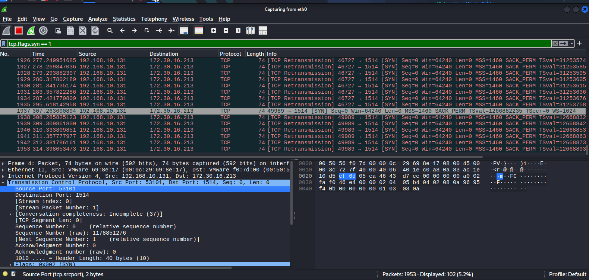

**Step-by-step walkthrough:**

1. **Display filter applied:** `tcp.flags.syn == 1` — entered in the green filter bar at the top. This narrows the view to only packets that have the SYN flag set, which are connection-initiation packets.
2. **Packet list (top pane):** Multiple rows all show TCP protocol. The Info column reads `[SYN] Seq=0 Win=64240 Len=0 MSS=1460 SACK_PERM TSval=...`. All packets originate from `192.168.10.131` and are directed to `172.30.16.213`, destination port `1514`.
3. **Notice the retransmissions:** Many rows are marked `[TCP Retransmission]`. This means the SYN was sent but no SYN-ACK was received, so the TCP stack automatically re-sent the SYN — a strong indicator that the destination port is not responding or is filtered.
4. **Packet detail (middle pane):** The selected frame shows `Transmission Control Protocol, Src Port: 53101, Dst Port: 1514, Seq: 0, Len: 0`. Expanding TCP reveals `Flags: 0x002 (SYN)` — confirming the SYN flag is the only flag set.
5. **Source Port 53101** is highlighted — this is the ephemeral (random high) port chosen by the client for this connection attempt.
6. **Hex dump (right pane):** The raw bytes of the packet are shown. This is useful for deep inspection or comparing against known malware signatures.
7. **Status bar (bottom):** `Packets: 1953 · Displayed: 102 (5.2%)` — out of 1953 total captured packets, only 102 match the SYN filter, showing the filter is effective.

---

#### 📸 Screenshot 2 — TCP ACK Filter with RST Responses

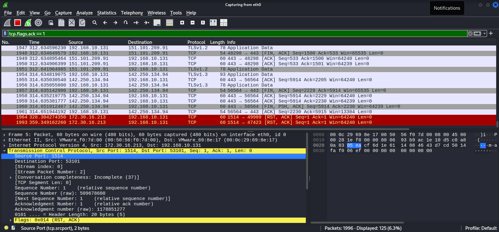

**Step-by-step walkthrough:**

1. **Display filter:** `tcp.flags.ack == 1` — shows all packets where the ACK flag is set. This includes normal ACKs in established connections, FIN-ACK, and RST-ACK.
2. **Mixed traffic visible:** The packet list shows a mix of TLSv1.2 and TLSv1.3 Application Data packets alongside TCP ACK packets — showing this capture contains real HTTPS browsing traffic.
3. **Red-highlighted rows:** Packets `1964` and `1993` are highlighted red — Wireshark colours RST or error-class packets red by default. Both show `[RST, ACK]` in the Info column. Source is `172.30.16.213` responding to `192.168.10.131`.
4. **RST-ACK meaning:** `RST, ACK` (`Flags: 0x014`) means the remote side is forcefully closing or refusing the connection — the destination port sent back a reset. This is what happens when a port scanner attempts a port that is closed or actively rejecting connections.
5. **Packet detail:** Selected frame 5 shows `Src Port: 1514, Dst Port: 53101` — this is the server-side RST response to the client's earlier SYN. `Sequence Number: 1`, `Acknowledgment Number: 1`.
6. **Status bar:** `Packets: 1996 · Displayed: 125 (6.3%)` — 125 ACK-flagged packets across the full capture.

---

#### 📸 Screenshot 3 — TCP SYN Scan (Second Capture)

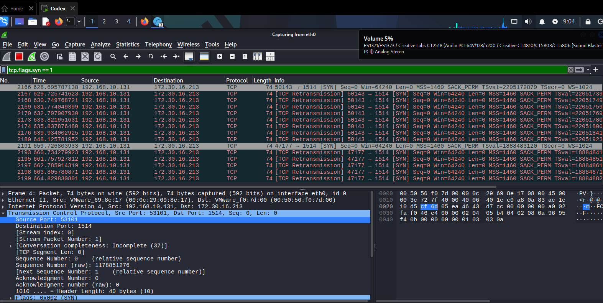

**Step-by-step walkthrough:**

1. **Same filter:** `tcp.flags.syn == 1` — this is a second capture session showing the same scanning pattern continuing.
2. **New source ports:** The scanner has now cycled to ports `50143` and `47177` as source ports, both targeting destination port `1514` at `172.30.16.213`.
3. **TCP retransmissions:** Every packet is a `[TCP Retransmission]`, meaning the original SYN was never answered. This pattern — sustained SYN retransmissions to the same destination port — is characteristic of a scanner probing a target that has filtering or firewall rules dropping the SYN without responding.
4. **Frame detail:** Frame 4, `74 bytes`, Src `192.168.10.131`, Dst `172.30.16.213`. TCP Src Port: `53101`, Dst Port `1514`. `Flags: 0x002 (SYN)`. Sequence Number `0`, raw value `1178851276`.
5. **Conversation completeness:** `Incomplete (37)` is shown — Wireshark tracks that this TCP stream never completed a full handshake, further confirming the connection was never established.
6. **Security takeaway:** Repeated SYN retransmissions to the same port from the same source are a textbook indicator of a port scanner running against a filtered target.

---

### Module 3 — DNS Analysis

**Purpose:** Capture and analyse DNS name resolution traffic to understand how domain names are translated to IP addresses.

**Wireshark Filter:**
```
dns
```

#### 📸 Screenshot 4 — nslookup tesla.com (Terminal)

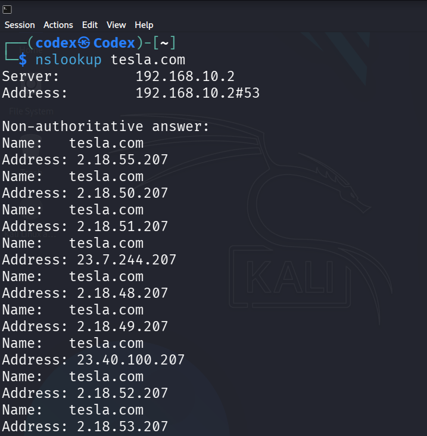

**Step-by-step walkthrough:**

1. **Command run:** `nslookup tesla.com` — this is a standard DNS lookup utility built into Linux. It sends a DNS query to the configured resolver and prints the response.
2. **DNS Server identified:** `Server: 192.168.10.2` / `Address: 192.168.10.2#53` — this is the DNS resolver the system is configured to use (port 53 is the standard DNS port).
3. **Non-authoritative answer:** This means the DNS server answered from its cache, not directly from Tesla's authoritative nameserver. This is normal for recursive resolvers.
4. **Multiple A records returned:** `tesla.com` resolved to 8 different IP addresses including `2.18.55.207`, `2.18.50.207`, `2.18.51.207`, `23.7.244.207`, `2.18.48.207`, `2.18.49.207`, `23.40.100.207`, `2.18.52.207`, and `2.18.53.207`. This is **DNS load balancing** — large services like Tesla distribute traffic across many servers using multiple A records.
5. **This traffic was captured:** After running this command, Wireshark captured the DNS UDP packets going to `192.168.10.2:53` and the responses coming back — visible in the next screenshots.

---

#### 📸 Screenshot 5 — DNS Queries in Wireshark

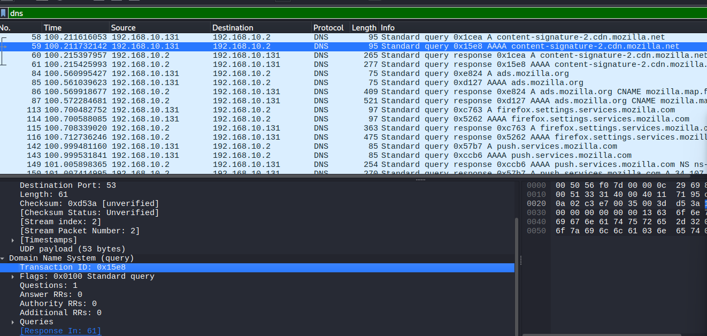

**Step-by-step walkthrough:**

1. **Display filter:** `dns` — shows only DNS protocol packets (UDP port 53, standard queries and responses).
2. **Packet list:** Every row has `Protocol: DNS`. The Info column shows `Standard query` for outgoing packets and `Standard query response` for incoming replies.
3. **Selected packet (row 59):** `192.168.10.131 → 192.168.10.2` — the client machine sends a DNS query to the resolver. Info: `Standard query 0x15e8 AAAA content-signature-2.cdn.mozilla.net` — this is a query for the IPv6 (AAAA) address of a Mozilla CDN domain.
4. **Transaction ID `0x15e8`:** Highlighted in the detail pane. Every DNS query is assigned a random 16-bit transaction ID. The DNS response must echo back this same ID so the client can match the response to the correct query. This is critical for detecting DNS spoofing attacks.
5. **Query details visible:** `Questions: 1`, `Answer RRs: 0`, `Authority RRs: 0`, `Additional RRs: 0` — this is a pure query, no answer data yet. The `Response In: 61` field links this query to its matching response in the capture.
6. **UDP payload: 53 bytes** — DNS queries are small, compact packets.
7. **Destination Port: 53** — all DNS traffic uses port 53.

---

#### 📸 Screenshot 6 — DNS Responses in Wireshark

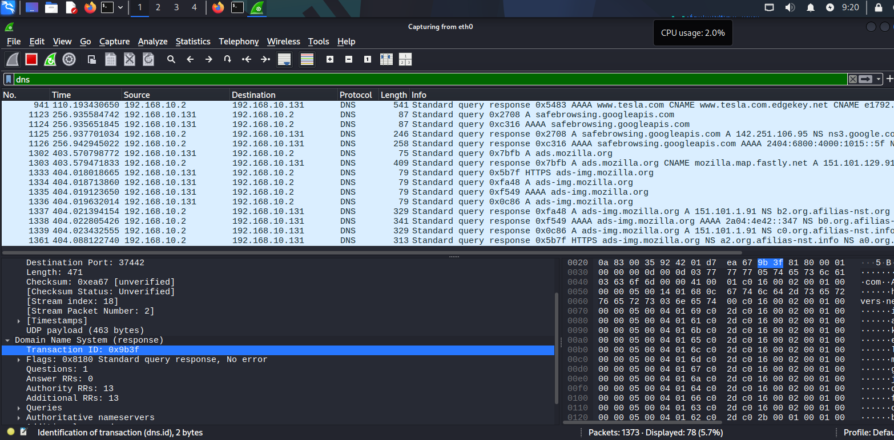

**Step-by-step walkthrough:**

1. **Same `dns` filter** — now scrolled further in the capture to show later DNS activity.
2. **DNS responses visible:** Rows show `Standard query response` in the Info column, with source now being `192.168.10.2` (the DNS server replying back to `192.168.10.131`).
3. **Domain variety captured:** The capture shows DNS activity for `tesla.com` (row 941), `safebrowsing.googleapis.com` (rows 1123–1126), `ads.mozilla.org` (rows 1302–1303), and `ads-img.mozilla.org` — reflecting real browser background activity alongside the manual nslookup.
4. **Selected packet Transaction ID `0x9b3f`:** A DNS response packet. The detail pane shows:
   - `Flags: 0x8180 Standard query response, No error` — the query was successfully resolved
   - `Questions: 1` — one question was asked
   - `Answer RRs: 0`, `Authority RRs: 13`, `Additional RRs: 13` — the response included 13 authoritative nameserver records and 13 additional glue records (common in responses for domain apex queries)
5. **UDP payload: 463 bytes** — DNS responses are larger than queries because they carry answer records.
6. **Security relevance:** DNS responses can be forged (DNS spoofing / cache poisoning). Validating transaction IDs, checking for unexpected CNAME chains, and monitoring for unusual query volumes are key SOC monitoring tasks.

---

### Module 4 — HTTP Analysis

**Purpose:** Capture unencrypted HTTP traffic to demonstrate full application-layer visibility.

**Wireshark Filter:**
```
http
```

#### 📸 Screenshot 7 — curl HTTP Request (Terminal)

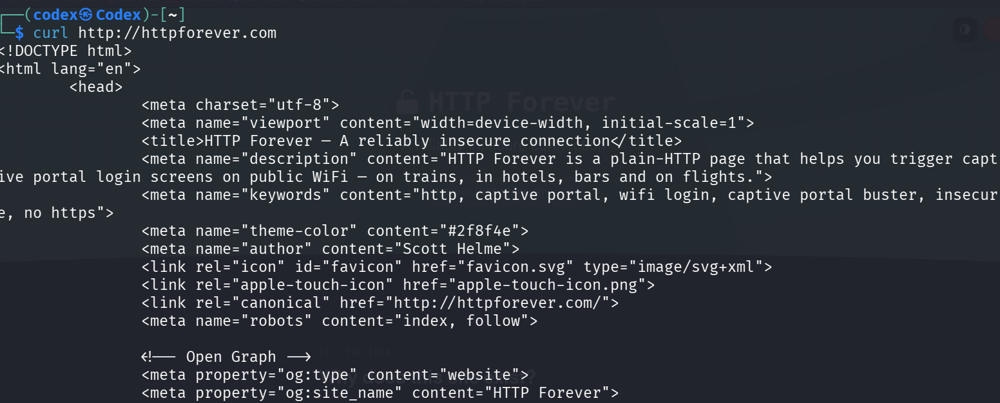

**Step-by-step walkthrough:**

1. **Command run:** `curl http://httpforever.com` — `curl` is a command-line HTTP client. This sends a plain HTTP GET request (no TLS/HTTPS) to the target site.
2. **Response received:** The terminal prints the raw HTML source of the page — the full `<!DOCTYPE html><html lang="en">` document is visible.
3. **Why httpforever.com?** This site is specifically designed to always serve plain HTTP (no HTTPS redirect), making it ideal for demonstrating cleartext HTTP traffic in a lab.
4. **Page title visible:** `<title>HTTP Forever – A reliably insecure connection</title>` — confirms this is an intentionally unencrypted site for testing.
5. **Key demonstration:** The complete HTML response — including all metadata — was visible in the terminal without any decryption step. This same data appears in Wireshark's packet capture, showing that anyone on the network path can read HTTP traffic.

---

#### 📸 Screenshot 8 — HTTP Packets in Wireshark

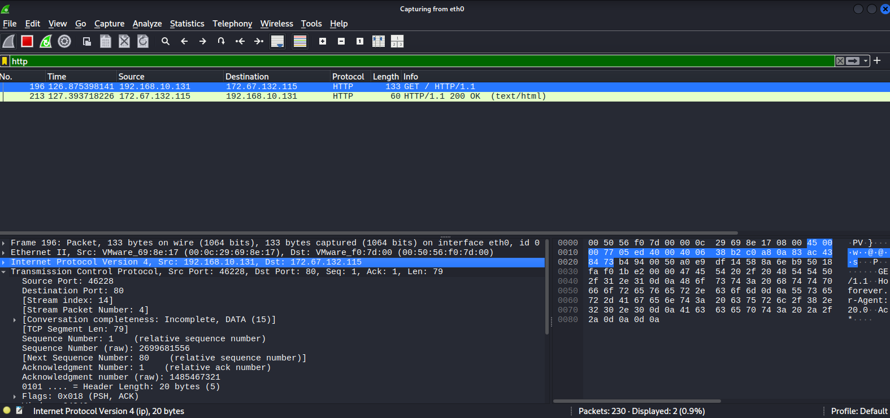

**Step-by-step walkthrough:**

1. **Display filter:** `http` — Wireshark displays only HTTP application-layer packets.
2. **Only 2 packets displayed:** Out of 230 total captured packets, only 2 match the `http` filter — the GET request and the 200 OK response. The status bar reads `Packets: 230 · Displayed: 2 (0.9%)`.
3. **Row 196 — HTTP GET Request:** `192.168.10.131 → 172.67.132.115`, Protocol: `HTTP`, Info: `GET / HTTP/1.1`. This is the client asking the server for the root page (`/`). The destination IP `172.67.132.115` is httpforever.com's server (Cloudflare-hosted).
4. **Row 213 — HTTP 200 OK Response:** `172.67.132.115 → 192.168.10.131`, Info: `HTTP/1.1 200 OK (text/html)`. The server replied with an HTML page — content type confirmed as `text/html`.
5. **Packet detail for row 196:**
   - **Frame 196:** 133 bytes captured
   - **Ethernet layer:** VMware_69:8e:17 → VMware_f0:7d:00 (MAC addresses)
   - **IP layer:** Src `192.168.10.131`, Dst `172.67.132.115` — highlighted in blue
   - **TCP layer:** Src Port `46228`, Dst Port `80` (HTTP), Seq: 1, Ack: 1, Flags: `PSH, ACK`
   - **HTTP layer** (not expanded but present): Contains the full GET request headers, host, user-agent, and any cookies — all in plaintext
6. **Security finding:** The entire HTTP request and response — including any credentials, session tokens, or sensitive form data — would be readable by any network observer. This is why plain HTTP must never be used for authenticated or sensitive sessions.

---

### Module 5 — HTTPS / TLS Analysis

**Purpose:** Capture HTTPS traffic and demonstrate that TLS encryption protects application data from passive observation.

**Wireshark Filter:**
```
tls
```

#### 📸 Screenshot 9 — TLS Client Hello (www.google.com)

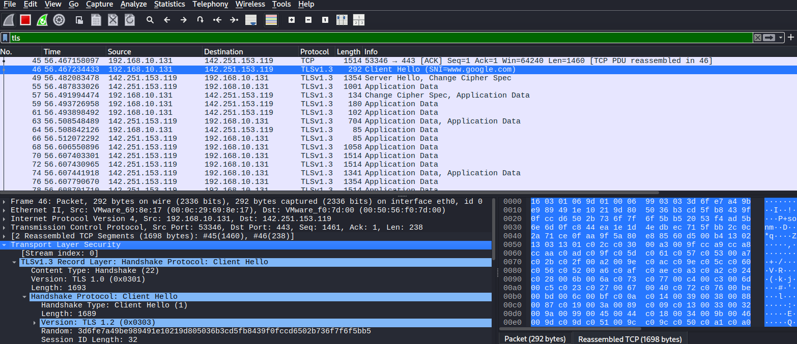

**Step-by-step walkthrough:**

1. **Display filter:** `tls` — shows all TLS protocol packets (typically on port 443).
2. **Packet list:** Multiple rows show `TLSv1.3` and `TLSv1.2` protocols. Info column shows `Client Hello`, `Server Hello, Change Cipher Spec`, and `Application Data` — the stages of a TLS handshake followed by encrypted data.
3. **Row 46 (selected) — TLS Client Hello:** `192.168.10.131 → 142.251.153.119` (Google's server). This is the first TLS handshake packet. Info: `Client Hello (SNI=www.google.com)`.
4. **SNI = Server Name Indication:** Even though the traffic is encrypted, the SNI field in the Client Hello is sent in plaintext so the server knows which certificate to present. An analyst can see that the user connected to `www.google.com` even without decrypting the session.
5. **TLS Record Layer detail:**
   - `Content Type: Handshake (22)`
   - `Version: TLS 1.0 (0x0301)` — the record layer version (legacy compatibility)
   - `Length: 1693`
   - **Handshake Protocol: Client Hello**, Handshake Type 1, Length 1689
   - **Version: TLS 1.2 (0x0303)** — the negotiated TLS version offered by the client
   - **Random:** `3d6fe7a49be989491e10219d805036b3cd5fb8439f0fccd6502b736f7f6f5bb5` — 32-byte random nonce used in key derivation
   - **Session ID Length: 32** — a session ID for potential resumption
6. **[2 Reassembled TCP Segments]:** The Client Hello was large enough to be split across 2 TCP segments. Wireshark reassembled them for display.
7. **After the handshake:** All subsequent `Application Data` rows contain only encrypted bytes — Wireshark cannot display the plaintext content, confirming TLS is working correctly.

---

#### 📸 Screenshot 11 — TLS Client Hello (nykaa.com)

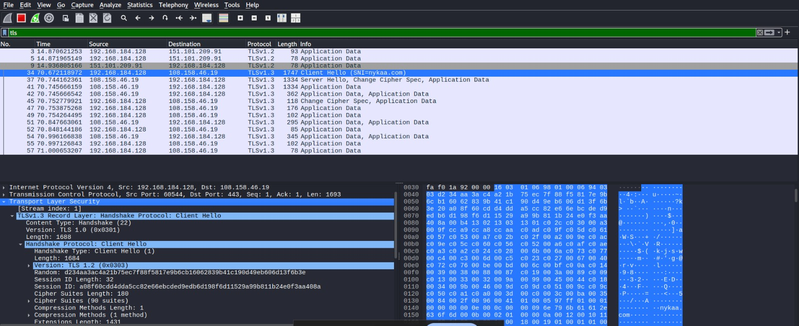

**Step-by-step walkthrough:**

1. **Display filter:** `tls` — same filter, different browsing session.
2. **Row 34 (selected) — Client Hello:** `192.168.184.128 → 108.158.46.19`, Info: `Client Hello (SNI=nykaa.com)`. This confirms the user browsed to `nykaa.com` (an HTTPS e-commerce site).
3. **Server Hello, Change Cipher Spec (row 37):** `108.158.46.19 → 192.168.184.128`, 1334 bytes. The server responds with its selected cipher suite and triggers the cipher change, after which the session is encrypted.
4. **Application Data rows:** Rows 41, 45, 47, 49, 51, 52, 54, 55, 57 — all show `Application Data` but the content is encrypted. Wireshark displays only the packet size and timing, not the actual data.
5. **TLS detail pane:**
   - `TLSv1.3 Record Layer: Handshake Protocol: Client Hello`
   - `Handshake Type: Client Hello (1)`, Length 1684
   - `Version: TLS 1.2 (0x0303)` — negotiated version
   - `Random: d234aa3ac4a21b75ec7f88f5817e9b6cb16062839b41c190d49eb606d13f6b3e`
   - **Session ID:** `a08f60cddd4dda5cc82e66ebcded9edb6d198f6d11529a99b811b24e0f3aa408a` — 32 bytes
   - **Cipher Suites: 90 suites** — the client advertises all supported cipher suites; the server picks one
   - **Extensions Length: 1431** — TLS extensions including SNI, supported groups, and signature algorithms
6. **Key point:** Even on a shopping site where you enter payment details, Wireshark shows only encrypted blobs — your card number and password are protected.

---

### Module 6 — ICMP Analysis

**Purpose:** Generate and capture ICMP traffic to study ping Echo Request/Reply packet structure.

**Wireshark Filter:**
```
icmp
```

#### 📸 Screenshot 10 — ICMP Echo Request / Reply

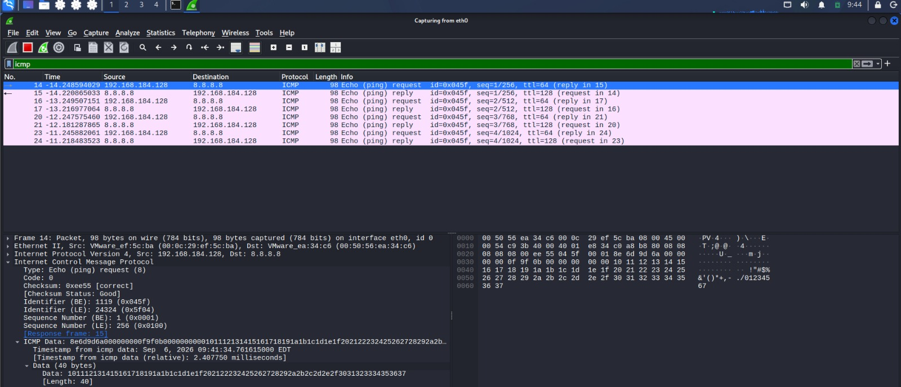

**Step-by-step walkthrough:**

1. **Display filter:** `icmp` — shows only ICMP protocol packets. The filter bar is green, confirming valid syntax.
2. **Command used:** `ping 8.8.8.8` — sends ICMP Echo Requests to Google's public DNS server.
3. **Alternating rows in packet list:**
   - **Pink/highlighted rows:** Echo (ping) **requests** — `192.168.184.128 → 8.8.8.8`, ICMP Type 8
   - **White rows:** Echo (ping) **replies** — `8.8.8.8 → 192.168.184.128`, ICMP Type 0
4. **Sequence numbers increment:** `seq=1/256`, `seq=2/512`, `seq=3/768`, `seq=4/1024` — each ping increments the sequence number, allowing the sender to match replies to requests and detect packet loss.
5. **TTL values:**
   - Request TTL: `64` — Linux default starting TTL
   - Reply TTL: `128` — Google's server returns packets with TTL 128 (Windows default), revealing the remote OS type
6. **Selected packet detail (Frame 14 — Echo Request):**
   - **Ethernet:** Src VMware_ef:5c:ba → Dst VMware_ea:34:c6
   - **IP:** Src `192.168.184.128`, Dst `8.8.8.8`
   - **ICMP type:** `Echo (ping) request (8)`, Code: `0`
   - **Checksum:** `0xee55` — verified as correct
   - **Identifier (BE):** `1119` (`0x045f`) — unique ID linking this request to its reply
   - **Sequence Number (BE):** `1` (`0x0001`), raw value `256` (little-endian)
   - **ICMP Data:** 40 bytes of payload (`1011121314...67`) — the ping payload content
7. **Response frame link:** `[Response frame: 15]` — Wireshark links each request directly to its reply frame.
8. **Security relevance:** ICMP is used in ping sweeps for host discovery. Blocked ICMP (no reply) can indicate a firewall. Unusual ICMP types or large payloads can indicate ICMP tunnelling.

---

### Module 7 — FTP Analysis

**Purpose:** Set up a local FTP server, capture FTP traffic, and demonstrate the security risks of cleartext credential transmission.

**Wireshark Filters:**
```
ftp
tcp.port == 21
```

#### 📸 Screenshot 12 — vsftpd FTP Server Setup

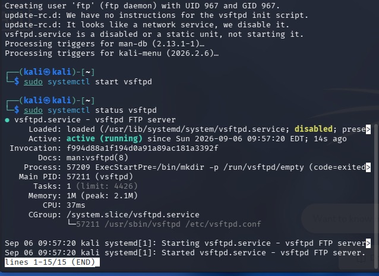

**Step-by-step walkthrough:**

1. **Package installation:** `sudo apt install vsftpd` — vsftpd (Very Secure FTP Daemon) is installed from the Kali Linux repository. The output shows it is being configured with UID 967 / GID 967 for the ftp daemon user.
2. **Note:** The message `update-rc.d: It looks like a network service, we disable it` appears — vsftpd is not set to auto-start on boot by default, which is a security-conscious default.
3. **Service started manually:** `sudo systemctl start vsftpd` — the FTP server is started for this lab session only.
4. **Service status confirmed:** `sudo systemctl status vsftpd` output shows:
   - `Loaded: loaded ... disabled; preset: disabled` — not enabled for auto-start (intentional for the lab)
   - `Active: active (running) since Sun 2026-09-06 09:57:20 EDT; 14s ago` — confirms the service is live
   - **Process PID:** `57211 (vsftpd)` — the running process ID
   - **Memory:** `1M (peak: 2.1M)` — very lightweight service
5. **This confirms:** The FTP server is running and ready to accept connections on TCP port 21 before any traffic is captured.

---

#### 📸 Screenshot 13 — FTP User Creation and Configuration

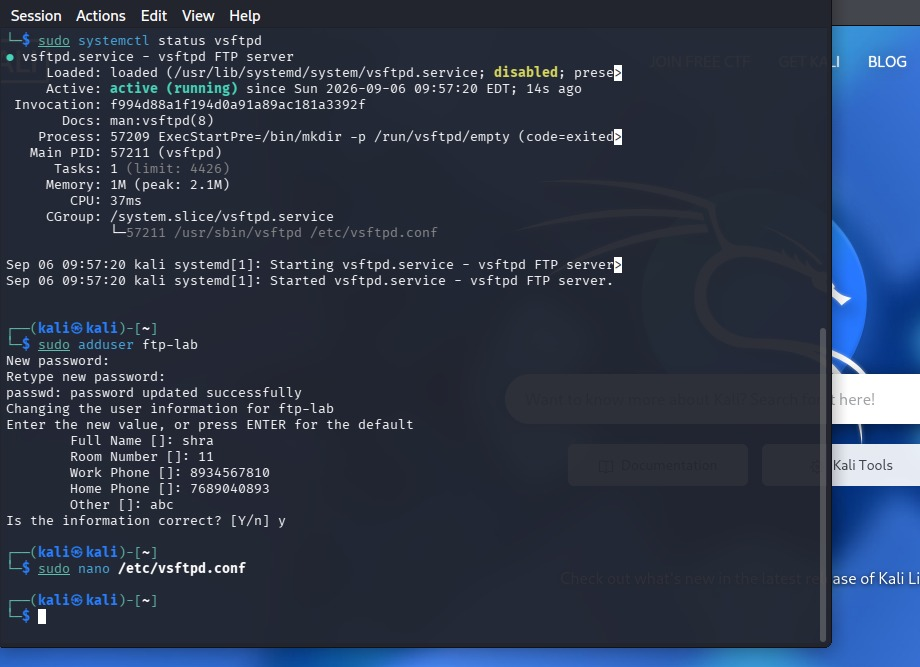

**Step-by-step walkthrough:**

1. **vsftpd status (top):** Service confirmed active and running (same as previous screenshot — shown for context).
2. **Create FTP test user:** `sudo adduser ftp-lab` — a dedicated system user `ftp-lab` is created specifically for this lab exercise.
3. **User details entered:**
   - Password set and confirmed
   - Full Name: `shra`
   - Room Number: `11`
   - Work Phone: `8934567810`
   - Home Phone: `7689040893`
   - Other: `abc`
   - Confirmed with `y`
4. **Edit FTP config:** `sudo nano /etc/vsftpd.conf` — the vsftpd configuration file is opened to enable local user logins. Key settings typically enabled include `local_enable=YES` and `write_enable=YES`.
5. **Why a dedicated user?** Creating a separate `ftp-lab` user limits risk — the test account has no sudo privileges and only has access to its home directory `/home/ftp-lab`.

---

#### 📸 Screenshot 14 — FTP Client Session (Terminal)

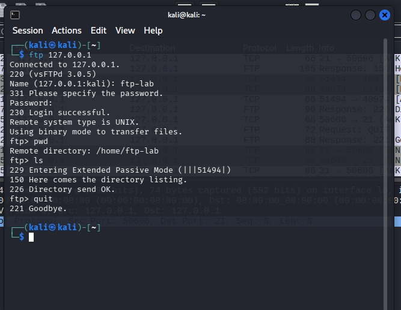

**Step-by-step walkthrough:**

1. **FTP client launched:** `ftp 127.0.0.1` — connects to the local FTP server using the loopback address. The connection succeeds immediately.
2. **Server banner:** `Connected to 127.0.0.1.` / `220 (vsFTPd 3.0.5)` — the server announces itself with the FTP 220 greeting, revealing the FTP software name and version number (an information disclosure risk in production).
3. **Login prompt:** `Name (127.0.0.1:kali): ftp-lab` — the username is entered in plaintext at the prompt.
4. **Password prompt:** `331 Please specify the password.` / `Password:` — the terminal hides the password visually, but **the password is transmitted in plaintext over the TCP connection**.
5. **Login successful:** `230 Login successful.` — FTP response code 230 confirms the credentials were accepted.
6. **Commands run inside the session:**
   - `ftp> pwd` → `Remote directory: /home/ftp-lab` — confirms the working directory
   - `ftp> ls` → `229 Entering Extended Passive Mode (|||51494|)` / `150 Here comes the directory listing.` / `226 Directory send OK.` — lists the remote directory
   - `ftp> quit` → `221 Goodbye.` — cleanly closes the session
7. **Note:** Even though the terminal doesn't show the password, Wireshark captured it on the wire — as shown in the next screenshot.

---

#### 📸 Screenshot 15 — FTP Captured in Wireshark

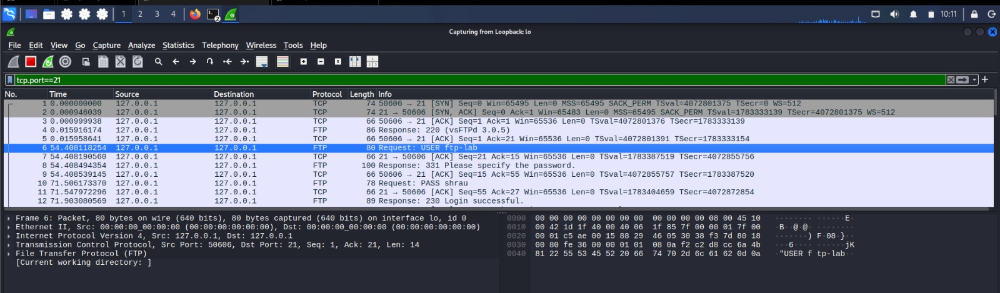

**Step-by-step walkthrough:**

1. **Display filter:** `tcp.port==21` — captures the FTP control channel (port 21) which carries all FTP commands and responses.
2. **Capture interface:** `Capturing from Loopback: lo` — since both the client and server were on the same machine, the loopback interface was used.
3. **Complete FTP session visible in packet list:**

   | Packet | Time | Direction | Protocol | Info |
   |---|---|---|---|---|
   | 1 | 0.000 | Client→Server | TCP | `SYN` — 3-Way Handshake starts. Port `50606 → 21` |
   | 2 | 0.001 | Server→Client | TCP | `SYN, ACK` — Server accepts |
   | 3 | 0.001 | Client→Server | TCP | `ACK` — Handshake complete |
   | 4 | 0.016 | Server→Client | FTP | `Response: 220 (vsFTPd 3.0.5)` — Server banner |
   | 5 | 0.016 | Client→Server | TCP | `ACK` — Client acknowledges banner |
   | **6** | **54.408** | **Client→Server** | **FTP** | **`Request: USER ftp-lab`** ⚠️ **username in plaintext** |
   | 7 | 54.408 | Client→Server | TCP | ACK |
   | 8 | 54.408 | Server→Client | FTP | `Response: 331 Please specify the password.` |
   | 9 | 54.409 | Client→Server | TCP | ACK |
   | 10 | 71.506 | Client→Server | FTP | `Request: PASS shrau` ⚠️ **password in plaintext** |
   | 11 | 71.548 | Client→Server | TCP | ACK |
   | 12 | 71.903 | Server→Client | FTP | `Response: 230 Login successful.` |

4. **Selected packet 6 detail:** Frame 6, 80 bytes, Src `127.0.0.1`, Dst `127.0.0.1`. Expanding FTP layer shows `[Current working directory: ]` and the raw USER command payload `USER ftp-lab` — the username is fully visible in the hex dump on the right: `55 53 45 52 20 66 74 70 2d 6c 61 62` = `USER ftp-lab`.
5. **Critical security finding:** The username `ftp-lab` and password `shrau` are both transmitted as cleartext ASCII text over the TCP connection. Anyone with access to the network path — a switch mirror port, a rogue device, or a compromised router — can read these credentials directly from the packet capture without any decryption.
6. **Real-world implication:** Traditional FTP should never be used to transfer sensitive files or authenticate over untrusted networks. Use **SFTP** (SSH-based, encrypted) or **FTPS** (FTP over TLS) instead.

---

### Module 8 — Attack Traffic Analysis

**Purpose:** Perform a controlled TCP port scan against an authorised lab system and identify network reconnaissance patterns in Wireshark.

> ⚠️ **Authorisation Statement:** This scan was performed exclusively against `localhost (127.0.0.1)` and a personal Metasploitable virtual machine under the operator's direct control. No external or third-party systems were targeted.

**Wireshark Filters:**
```
tcp.flags.syn == 1
tcp
```

#### 📸 Screenshot 16 — Nmap Port Scan (Terminal)

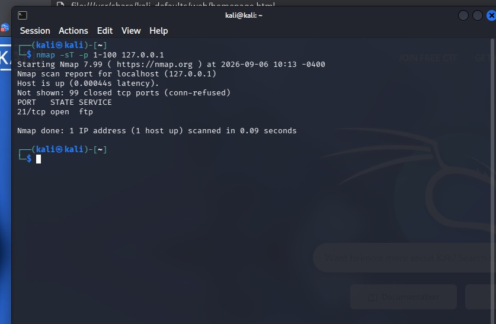

**Step-by-step walkthrough:**

1. **Command run:** `nmap -sT -p 1-100 127.0.0.1`
   - `-sT` — TCP Connect scan (full 3-way handshake per port, uses the OS TCP stack)
   - `-p 1-100` — scan only ports 1 through 100
   - `127.0.0.1` — target is localhost (the same machine)
2. **Nmap version:** `Starting Nmap 7.99 ( https://nmap.org ) at 2026-09-06 10:13 -0400`
3. **Host discovery:** `Host is up (0.00044s latency)` — localhost responds instantly.
4. **Scan result:**
   - `Not shown: 99 closed tcp ports (conn-refused)` — 99 ports refused the connection (RST response)
   - `PORT    STATE  SERVICE` — the results table
   - `21/tcp  open   ftp` — **port 21 is open** because vsftpd is still running from Module 7
5. **Scan time:** `Nmap done: 1 IP address (1 host up) scanned in 0.09 seconds` — the full 100-port scan completed in under a tenth of a second.
6. **Why this matters:** This exact output tells an attacker which services are running. In a real incident, a SOC analyst finding similar Nmap output in logs or traffic would treat it as reconnaissance activity and investigate immediately.

---

#### 📸 Screenshot 17 — Port Scan Captured in Wireshark

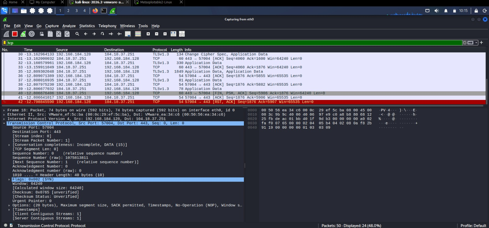

**Step-by-step walkthrough:**

1. **Second scan scenario:** This Wireshark capture was taken during a scan from Kali Linux (`192.168.184.128`) against a Metasploitable Linux VM (`104.18.37.251`). The `tc` filter is applied showing all TCP traffic.
2. **Capture interface:** `Capturing from eth0` — network interface used between the two VMs.
3. **Packet list reveals scanning pattern:**
   - Rows show traffic from `192.168.184.128 → 104.18.37.251` (Kali → Metasploitable)
   - Multiple rows with `TLSv1.3` and mixed TCP packets visible — normal HTTPS background traffic mixed with the scan traffic
4. **Red-highlighted row (packet 42):** `192.168.184.128 → 104.18.37.251`, Protocol TCP, Info: `[RST, ACK] Seq=1876 Ack=5907 Win=65535 Len=0`. The scanner sends a RST after completing the connect scan — the OS-level TCP stack closes the connection once Nmap has detected the port state.
5. **Selected frame detail (Frame 18 — SYN packet):**
   - **Source Port:** `57004` — ephemeral port used by the scanner
   - **Destination Port:** `443` — Nmap checking if HTTPS is open
   - **Seq: 0, Len: 0** — typical SYN packet, no data
   - **Flags: `0x002 (SYN)`** — SYN flag only
   - **Window: 64240** — default OS window size
   - **Options:** MSS, SACK, Timestamps, NOP, Window Scale — standard TCP options that can fingerprint the OS
6. **Conversation completeness: Incomplete, DATA (15):** Wireshark confirms the TCP streams are incomplete — the scanner does not maintain full connections, it just probes each port and moves on.
7. **How to identify this as a scan:**
   - Many SYN packets in a short burst to the same target host
   - Different destination ports rapidly (sequential or random)
   - RST-ACK responses to every closed port
   - Short-lived conversations — no real data exchange
   - Packets: 50 total — `Displayed: 24 (48.0%)` showing dense scan activity

---

## 🔍 Wireshark Filters Reference

| Filter | Purpose |
|---|---|
| `tcp` | Show all TCP protocol traffic |
| `tcp.flags.syn == 1` | Packets with SYN flag — connection initiation or port scanning |
| `tcp.flags.ack == 1` | Packets with ACK flag — established connection segments |
| `dns` | All DNS queries and responses (UDP port 53) |
| `http` | All plaintext HTTP traffic (TCP port 80) |
| `tls` | All TLS/HTTPS encrypted traffic (TCP port 443) |
| `icmp` | All ICMP traffic — ping, traceroute, error messages |
| `ftp` | FTP control channel commands and responses |
| `tcp.port == 21` | All TCP traffic on port 21 — FTP control connection |

---

## ⚖️ HTTP vs HTTPS Comparison

| Attribute | HTTP | HTTPS |
|---|---|---|
| **Port** | 80 | 443 |
| **Encryption** | None — plaintext | TLS (Transport Layer Security) |
| **Visibility in Wireshark** | Full payload readable | Only metadata visible; payload encrypted |
| **Credential Safety** | Credentials exposed in plaintext | Credentials protected by TLS |
| **Certificate** | Not required | Server certificate required |
| **TLS Version observed** | N/A | TLSv1.3 (TLS 1.2 negotiated in some sessions) |
| **Security Recommendation** | Never use for sensitive data | Required for all modern web applications |

---

## 🔴 Security Findings Summary

| Protocol | Key Finding |
|---|---|
| **TCP** | SYN retransmissions and RST-ACK bursts are strong indicators of port scanning activity |
| **DNS** | DNS queries reveal hostnames being resolved — transaction IDs link queries to responses; monitor for unusual domains |
| **HTTP** | All application data, headers, and request content fully visible in plaintext — no confidentiality |
| **HTTPS/TLS** | TLS 1.3 encrypts application data; Client Hello SNI field still reveals the target hostname |
| **ICMP** | TTL differences (64 vs 128) reveal OS types; ICMP can be used for host discovery and covert tunnelling |
| **FTP** | Username and password transmitted in plaintext over TCP port 21 — critical risk in any non-isolated environment |
| **Port Scanning** | Rapid SYN bursts to sequential ports with RST-ACK responses are clear indicators of network reconnaissance |

---

## 🧑‍💻 SOC Analyst Perspective

Wireshark is a core tool in the SOC analyst's toolkit. This project demonstrates how packet-level visibility supports each stage of the investigation workflow:

```
Traffic Captured on Network
          │
          ▼
    Packet Capture
    (Wireshark / tcpdump)
          │
          ▼
    Display Filtering
    (Protocol, IP, Port, Flag filters)
          │
          ▼
    Protocol Analysis
    (Decode TCP, DNS, HTTP, TLS, ICMP, FTP)
          │
          ▼
    Identify Anomaly
    (SYN floods, cleartext creds, unusual DNS, RST bursts)
          │
          ▼
    Investigation
    (Follow TCP Stream, Export Objects, Check Statistics)
          │
          ▼
    Security Finding
    (Document IOCs, affected hosts, attack timeline)
          │
          ▼
    Response
    (Block IPs, notify stakeholders, escalate, remediate)
```

| SOC Use Case | How Wireshark Supports It |
|---|---|
| **Network Investigation** | Filter by IP, port, or protocol to isolate relevant traffic |
| **Incident Response** | Reconstruct attack timeline from PCAP evidence |
| **Suspicious Traffic Analysis** | Identify unusual patterns in protocol flags and packet sequences |
| **Reconnaissance Detection** | Identify SYN scan patterns, port sweep behaviour |
| **Protocol Analysis** | Inspect application-layer protocols for data leakage |
| **Threat Investigation** | Follow TCP streams to reconstruct sessions; export files from HTTP |

---

## 🧠 Skills Demonstrated

| Category | Skills |
|---|---|
| **Network Analysis** | Packet capture, protocol dissection, traffic filtering |
| **Protocols** | TCP/IP, DNS, HTTP, HTTPS/TLS, ICMP, FTP |
| **Tools** | Wireshark, Nmap, vsftpd, curl, nslookup |
| **Operating System** | Kali Linux, systemd service management |
| **Security Analysis** | Reconnaissance detection, cleartext credential identification, anomaly detection |
| **SOC Skills** | Traffic investigation, incident analysis, filter-based triage |

---

## 📈 Learning Outcomes

Through completing this lab, the following practical cybersecurity skills were developed:

- **Protocol mechanics:** Deep understanding of how TCP, DNS, HTTP, TLS, ICMP, and FTP work at the packet level
- **Wireshark proficiency:** Applying display filters, reading packet detail panes, interpreting hex dumps, and following TCP streams
- **Security risk identification:** Recognising the risk of cleartext protocols (HTTP, FTP) versus encrypted alternatives (HTTPS, SFTP)
- **Reconnaissance awareness:** Understanding how port scans appear in packet captures and how to distinguish scanning from legitimate traffic
- **Lab environment setup:** Configuring vsftpd, managing Linux services, and generating targeted test traffic in an isolated environment
- **SOC analyst mindset:** Applying structured investigation workflows to raw packet data

---

## 🔮 Future Improvements

| Improvement | Description |
|---|---|
| **ARP Analysis** | Capture ARP requests/replies and investigate ARP spoofing scenarios |
| **DHCP Analysis** | Capture DHCP Discover/Offer/Request/Acknowledge cycle |
| **Advanced TLS Analysis** | Decrypt TLS sessions using SSLKEYLOGFILE and analyse application data |
| **Advanced Wireshark Filters** | Build custom display and capture filter profiles |
| **Automated PCAP Analysis** | Use `tshark` command-line for scripted analysis |
| **MITRE ATT&CK Mapping** | Map observed patterns to ATT&CK techniques (e.g., T1046 Network Service Discovery) |
| **SIEM Integration** | Forward captured alerts to Splunk or ELK Stack |
| **Threat Detection Rules** | Write Suricata or Snort IDS rules based on observed scanning patterns |
| **FTPS / SFTP Lab** | Compare encrypted FTP alternatives against cleartext FTP |

---

## ⚖️ Ethical & Legal Disclaimer

> All network traffic generation, packet capture, port scanning, and protocol analysis performed in this project was conducted exclusively on systems personally owned or explicitly authorised for testing within a **controlled, isolated virtual lab environment**.
>
> No external systems, third-party networks, or production infrastructure were targeted at any point. All Nmap scans were directed at `localhost (127.0.0.1)` or virtualised lab machines under the operator's direct control.
>
> This project is intended solely for **educational purposes** to develop cybersecurity skills in a responsible and legal manner.

---

## 👤 Author

**Codex Wink**  
*Cybersecurity Student | B.Tech Computer Science | Networking & Cybersecurity Enthusiast*

[](https://github.com/Codexe0)

---

*Built with Wireshark · Kali Linux · Nmap · vsftpd · Practical hands-on lab methodology*
